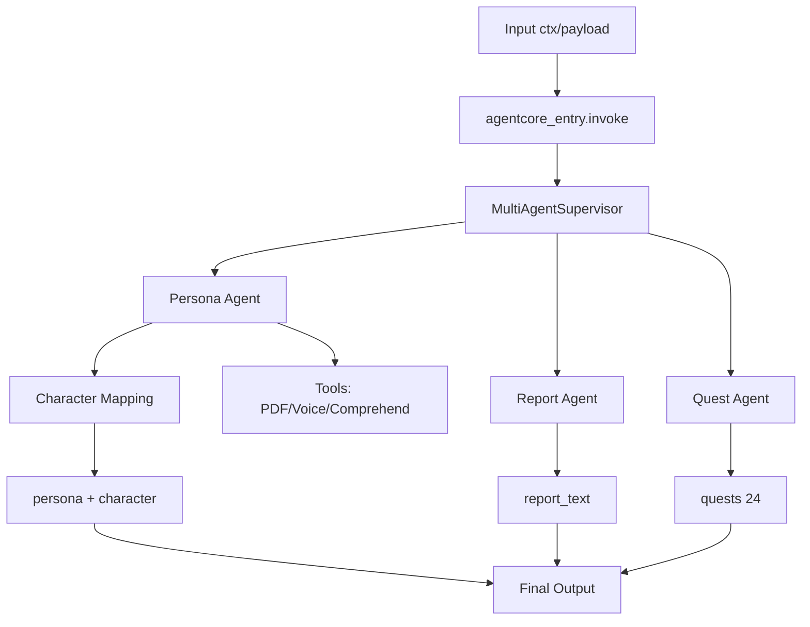

# tamacoach
TamaCoach: 멀티 에이전트 AI 퍼스널 코칭 서비스  클라우드 보안 환경(VPC) 내에서 동작하는 멀티 에이전트(Multi-Agent) 기반의 실시간 맞춤형 코칭 서비스입니다. 단순한 단일 LLM 호출을 넘어, 역할을 분담한 여러 에이전트가 협력하여 사용자에게 매일 최적화된 퀘스트와 리포트를 제공합니다.
# 🎯 TamaCoach : 엔터프라이즈 보안 환경을 고려한 멀티 에이전트 AI 코칭 서비스

TamaCoach는 클라우드 보안 환경(VPC) 내에서 실시간으로 동작하는 **멀티 에이전트(Multi-Agent) 기반 맞춤형 퍼스널 코칭 시스템**입니다. 

단순한 LLM API 호출을 넘어, 기업용 AI 도입 시 가장 중요한 **데이터 보안(Macie, VPC)**과 **처리 속도 및 비용 최적화(준병렬 아키텍처, 모델 혼합)**에 중점을 두고 아키텍처를 설계했습니다.

---

## 📂 Repository Structure
본 프로젝트는 시스템의 확장성과 유지보수를 위해 역할별로 레포지토리를 분리하여 관리하고 있습니다. 상세한 코드와 구현 내역은 아래의 개별 레포지토리에서 확인하실 수 있습니다.

* 🔗 **[Agent  Repository] https://github.com/harryjdh/tama-agent** : 멀티 에이전트 오케스트레이션(Strands), AWS 인프라 및 보안(VPC, Macie) 구성, API 통신 로직
* 🔗 **[Chatbot Repository]https://github.com/harryjdh/tm-chatbot** : Langchain기반 RRF알고리즘(rerank+하이브리드서치), 멀티에이전트 로직

---

## 💡 Key Highlights (엔터프라이즈 AI 아키텍처 관점)

### 1. 망 분리 환경을 고려한 AI 보안 인프라 (Security & Privacy)
* **VPC 기반의 독립된 AI 환경:** AWS Bedrock AgentCore를 **VPC 내부에 배포**하고, 외부 인터넷망을 거치지 않는 **VPC Endpoints**를 활용하여 안전한 AI 통신 아키텍처를 구현했습니다.
* **민감 데이터 보호 시스템:** 백엔드에 **AWS Macie를 구성**하여 사용자 입력 데이터 중 민감 정보가 포함될 경우 이를 안전하게 식별하고 처리할 수 있도록 보안 수준을 높였습니다.

### 2. Strands 기반 멀티 에이전트 오케스트레이션 및 최적화
* **준병렬 처리 구조 도입:** 기존 직렬 파이프라인의 병목 현상을 해결하기 위해, **Strands**를 활용하여 `Supervisor` -> `페르소나 분석` -> `[ 리포트 생성 || 퀘스트 생성 ]`의 **준병렬 구조(Quasi-parallel)**로 에이전트 워크플로우를 재설계했습니다.
* **실시간 처리 성능 향상:** 배치 처리가 아닌 실시간(Real-time) API 처리 방식을 채택하였으며, 구조 최적화를 통해 전체 에이전트의 응답 및 처리 시간을 **60초에서 40초로 약 33% 단축**했습니다.

### 3. 비즈니스 효율성을 위한 LLM 비용 절감 (Cost Optimization)
* **목적에 따른 모델 하이브리드 운영:** 고도의 추론이 필요한 페르소나 및 리포트 에이전트에는 **Claude Sonnet 4.6**을 적용하고, 매일 35개의 과제를 대량으로 생성해야 하는 퀘스트 생성 에이전트에는 상대적으로 가볍고 빠른 **Claude Haiku** 모델을 전략적으로 채택했습니다.
* **비용 절감 성과:** 퀄리티 저하 없이 전체 AI 시스템 운영의 **토큰 비용을 약 25% 절감**하는 효율성을 입증했습니다.

### 4. 확장 가능한 AI 생태계 구축
* **AWS API MCP 활용:** AWS Transcribe 및 Comprehend 서비스를 에이전트 워크플로우 내에 유기적으로 연동하여 멀티모달 데이터 처리 및 분석의 기반을 마련했습니다.
* **독립적인 챗봇 시스템:** 무거운 멀티 에이전트 시스템과 사용자 응대용 챗봇 에이전트를 아키텍처상 분리하여 리소스 효율성을 극대화했습니다.

---

## 🏗️ System Architecture

### Multi-Agent Workflow
1. **Supervisor Agent:** 전체 워크플로우 통제 및 데이터 라우팅
2. **Persona Analysis Agent:** 사용자 데이터를 기반으로 성향 분석 (Claude Sonnet 4.6)
3. **Report Agent (병렬 수행):** 페르소나를 바탕으로 사용자 맞춤형 분석 리포트 생성 (Claude Sonnet 4.6)
4. **Quest Agent (병렬 수행):** 사용자의 일일 맞춤형 퀘스트 35개 생성 (Claude Haiku 적용으로 비용 최적화)
> *※ 챗봇 에이전트는 본 멀티 에이전트 파이프라인과 독립적으로 구성되어 실시간 응대에 집중합니다.*

---

## 🛠️ Tech Stack
* **AI / LLM :** AWS Bedrock (Claude Sonnet 4.6, Claude 3 Haiku), Strands (Agent Orchestration)
* **Cloud Infrastructure :** AWS VPC, VPC Endpoints
* **Security & Integration :** AWS Macie, AWS API MCP (Transcribe, Comprehend)
* **Processing :** Real-time API Processing
